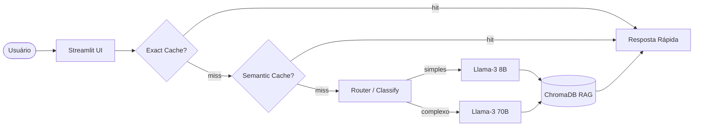

# Google Python Code Reviewer 🐍

> **Assistente inteligente de revisão de código baseado no Google Python Style Guide, impulsionado por RAG e Semantic Caching.**

<!-- Cole aqui o seu GIF demonstrando o uso da interface -->
*(Espaço reservado para o GIF de demonstração)*

**Live demo:** [Insira seu link do Streamlit Cloud aqui]

## 🎯 Problem Statement

1. **Qual problema você resolve?** Desenvolvedores gastam muito tempo consultando regras de estilo (PEP-8 e guias empresariais) ou deixam passar formatações inconsistentes.
2. **Para quem?** Engenheiros de software, times de desenvolvimento e revisores de PRs que programam em Python.
3. **Por que LLM + RAG + Tool-use?** Um LLM genérico alucina regras ou mistura padrões. Com o RAG focado estritamente no *Google Python Style Guide*, o modelo baseia suas respostas em documentação oficial. A arquitetura também permite usar ferramentas como Linters (Tool-use) sob demanda.

## 🏗️ Arquitetura



## 🚀 Setup Local

```bash
# 1. Clone o repositório
git clone <seu-repo>
cd projeto-portfolio

# 2. Crie o ambiente virtual e instale as dependências (via uv)
uv venv
source .venv/bin/activate
uv pip install -r requirements.txt # Ou use uv sync se configurado no pyproject

# 3. Configure as variáveis de ambiente
cp .env.example .env
# Edite o .env com sua GROQ_API_KEY (ou OPENAI_API_KEY)

# 4. Rode a aplicação
uv run streamlit run src/ui/streamlit_app.py
```

## 💰 Cost & Latency (Estimativa)

Graças ao roteamento de complexidade e ao sistema de duplo cache (Exato + Semântico), otimizamos drasticamente os custos da API.

| Estratégia | Custo relativo | Redução |
|---|---:|---:|
| Baseline (Premium Sempre) | 100% | — |
| + Exact cache | 85% | 15% |
| + Semantic cache | 65% | 35% |
| **+ Routing cheap-first** | **~25%** | **~75%** |

## 🧠 Design Decisions

- **Embedding Multilíngue:** Optamos por `paraphrase-multilingual-MiniLM-L12-v2`. Isso permite que o usuário faça perguntas em *Português* e o banco vetorial consiga buscar perfeitamente no Style Guide que está em *Inglês*.
- **Chunking (800 / 100):** O chunk de 800 caracteres garante que os exemplos de código de `Certo/Errado` (Yes/No) da documentação do Google não sejam partidos no meio, provendo um contexto coeso ao LLM.
- **Roteamento Híbrido:** Consultas curtas (ex: "Como usar decorators?") usam modelos menores e rápidos (8B). Revisões de blocos inteiros de código acionam o modelo de maior capacidade (70B) para evitar erros de lógica.
- **Prevenção de Loops:** O RAG está parametrizado com `temperature=0.2` e `frequency_penalty=0.5` para evitar loops de alucinação comuns em modelos menores rodando com temperatura zero.

## ⚠️ Limitations

- **Conteúdo Fixo:** O corpus baseia-se num snapshot estático em Markdown do guia do Google. Atualizações no guia oficial não refletem automaticamente.
- **Foco Estrito:** O LLM foi instruído a dizer "Não encontrado" caso a pergunta fuja de padrões de estilo. Não serve como um chatbot de programação genérico.

## 🛠️ Tech Stack

- **LLM:** Groq API (Llama-3-8B-8192 e Llama-3-70B-8192)
- **Embeddings:** `sentence-transformers` (Multilingual MiniLM)
- **Vector store:** ChromaDB (Persistência local)
- **UI:** Streamlit (Layout Wide, Custom Sidebar)
- **Observability:** Logs de tempo e trace estruturados nativos.
